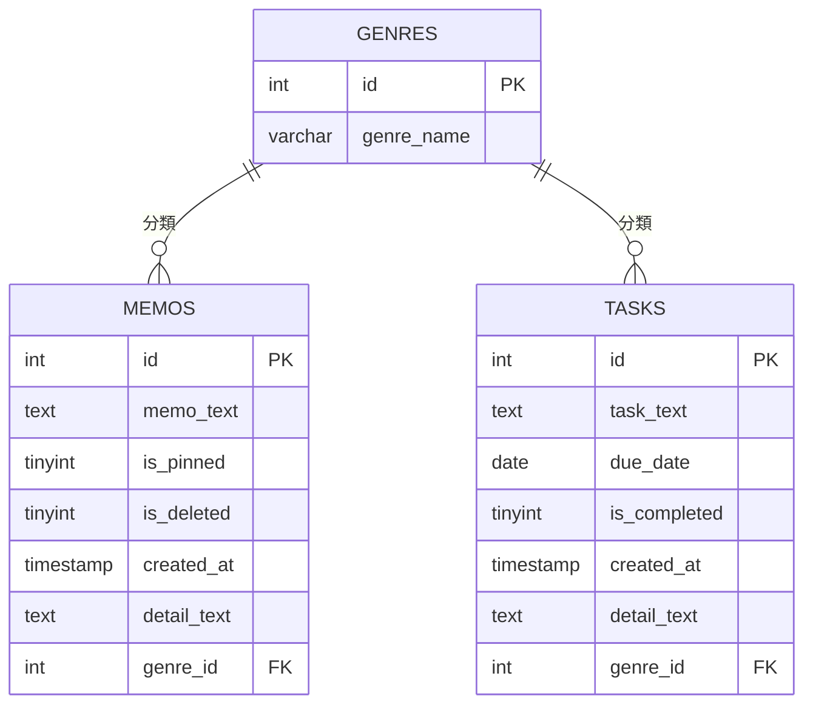

# Jot

> **雑に残せて、ちゃんと見つかる。**

思いついたことをすぐに記録し、メモとタスクを一元管理できるWebアプリです。

---

## 概要（What）

**Jot** は、日々のメモやタスクを一か所にまとめて管理するためのWebアプリです。

思いついたことをまず入力し、その内容を「メモ」または「タスク」として保存できます。

また、ジャンル分けや検索機能を使うことで、蓄積した情報の中から必要な情報を後から探せるようにしています。

アプリ名の「Jot」には、英語の **「さっと書き留める」** という意味があります。

「入力するときは気軽に、必要になったときにはちゃんと見つけられる」という、このアプリのコンセプトを表しています。

---

## 背景（Why）

日常生活の中で、やるべきことや思いついたことを忘れないように、スマートフォンのメモアプリへ記録することが多くありました。

しかし、記録する情報が増えていくにつれて、

- メモとタスクが混在する
- 過去に記録した情報が埋もれる
- 「どこに書いたか分からない」状態になる
- 記録しただけで、その後見返さなくなる

といった問題を感じるようになりました。

一方で、情報を記録するたびに細かく分類したり、保存場所を考えたりする仕組みにすると、入力自体が面倒になってしまいます。

そこで、

**「入力するときはできるだけ手軽に、必要になったときにはきちんと見つけられる」**

状態を目指して、Jotを開発しました。

---

## 主な機能

### メモ機能

思いついたことや残しておきたい情報を、すぐにメモとして保存できます。

保存したメモは編集・削除でき、重要なメモはピン留めして上部に表示できます。

### タスク管理機能

やるべきことをタスクとして登録できます。

期限の設定や完了処理にも対応しており、未完了のタスクを確認できます。

### ジャンル機能

メモやタスクにジャンルを設定できます。

ジャンルの設定は必須ではなく、まず情報を保存してから、必要に応じて後から整理することもできます。

これにより、「保存する前に分類を考えなければならない」という手間を減らしています。

### 検索機能

蓄積した情報を、

- キーワード
- ジャンル
- 期間

などの条件から検索できます。

複数の条件を組み合わせることで、情報が増えても必要なメモやタスクを探しやすくしています。

---

## 使い方（How）

1. 入力欄に残したい内容を入力します。
2. 「メモ」または「タスク」として保存します。
3. 必要に応じてジャンルや期限を設定します。
4. 保存した情報は、メモ画面・タスク画面から確認できます。
5. 過去の情報を探したい場合は、検索機能を利用します。

### 公開アプリ

**Jotを実際に操作できます。**

https://memo-task-app.great-site.net/demo/

---

## 前提条件 / 実行環境

### 使用技術

- HTML
- CSS
- PHP
- MySQL

### 開発環境

- Visual Studio Code
- XAMPP
- phpMyAdmin

---

## 技術的な工夫

### 複数条件による検索

キーワード・ジャンル・期間などを組み合わせて検索できるようにしました。

入力された検索条件に応じてSQLの検索条件を変更することで、複数条件による絞り込みを実現しています。

### 情報に応じた表示順

メモとタスクでは、必要な情報を見つけやすくするため、それぞれ異なる表示順を設定しています。

メモはピン留めされたものを優先し、その後に新しいものから表示しています。

タスクは期限の有無や期限日などを考慮して並び替えることで、取り組む必要のあるタスクを確認しやすくしています。

### データベースを利用した情報管理

メモ・タスク・ジャンルの情報をMySQLで管理しています。

メモとタスクそれぞれに `genre_id` を持たせ、ジャンル情報と関連付けることで、ジャンルによる分類や検索を行えるようにしています。

また、メモのピン留め・削除状態、タスクの完了状態、期限、詳細情報などもデータベース上で管理しています。

---

## スクリーンショット

### メイン画面


### メモ画面


### タスク画面


### ジャンル管理画面


### 検索画面


---

## ER図

Jotでは、`memos`、`tasks`、`genres` の3つのテーブルを使用しています。

メモとタスクがそれぞれ `genre_id` を持ち、`genres` テーブルと関連する構成にしています。



---

## ディレクトリ構成

主要なファイルを役割ごとに整理しています。

```text
memo-task-app/
├── actions/
│   ├── save.php
│   ├── memo_update.php
│   ├── task_update.php
│   └── genre_update.php
│
├── assets/
│   ├── css/
│   │   └── style.css
│   │
│   └── images/
│       ├── home.png
│       ├── memo.png
│       ├── task.png
│       ├── genres.png
│       └── search.png
│
├── config/
│   └── db.example.php
│
├── includes/
│   ├── input_form.php
│   └── calendar.php
│
├── index.php
├── memos.php
├── tasks.php
├── search.php
├── genre_manage.php
├── README.md
└── .gitattributes
```

### 各ディレクトリの役割

- `actions/`：保存・更新・完了・削除などの処理
- `assets/`：CSSやREADME掲載用画像などの静的ファイル
- `config/`：データベース接続設定
- `includes/`：複数画面で利用する共通処理・UI

データベースの接続情報そのものは公開せず、構成を確認できるように `db.example.php` を掲載しています。

---

## 補足・今後の改善点

現在の基本機能に加えて、今後は以下のような改善を検討しています。

- スマートフォンでの操作性向上
- 複数ワークスペースへの対応
- ログイン機能の実装
- UI・デザインの改善
- コードのさらなる共通化・整理

---

## 作者

個人開発のポートフォリオとして制作しました。
