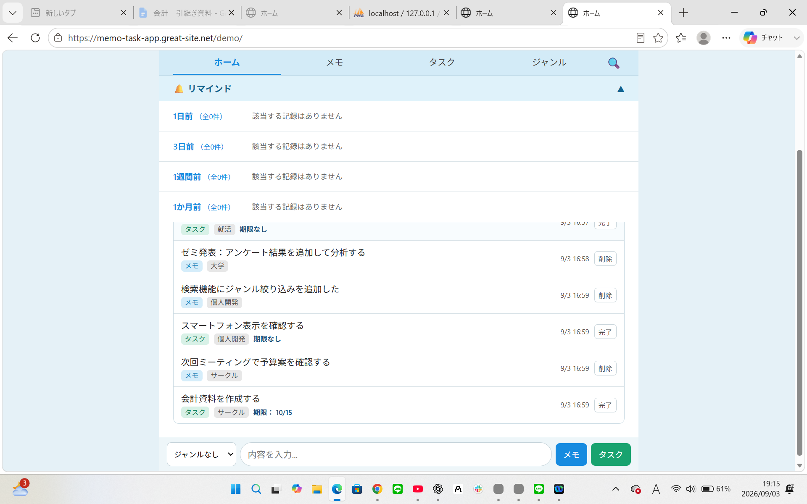
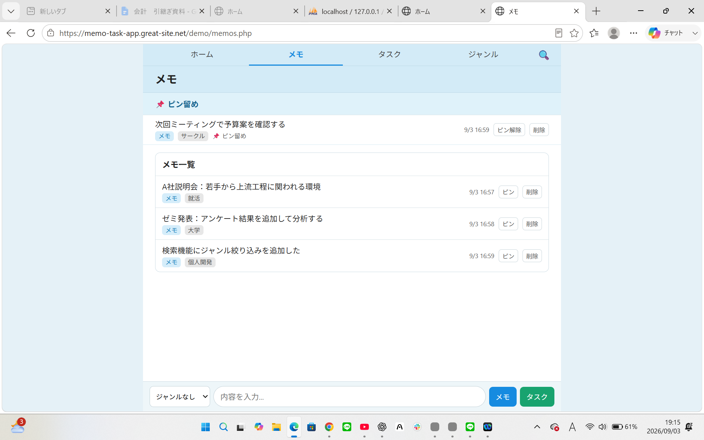
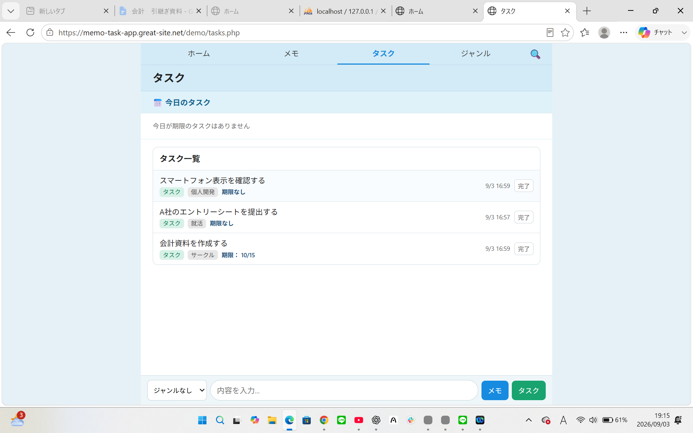
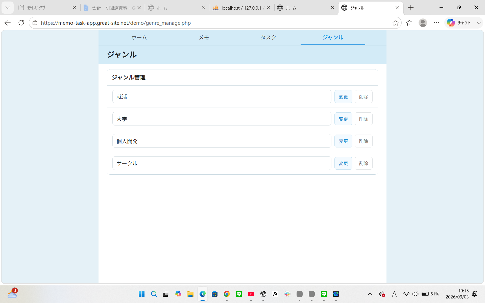
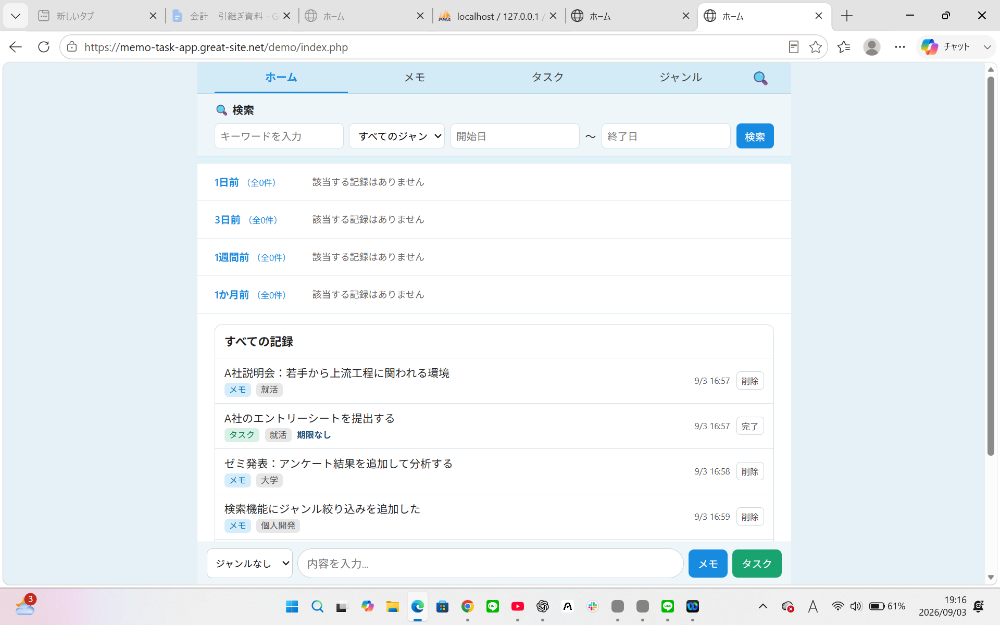
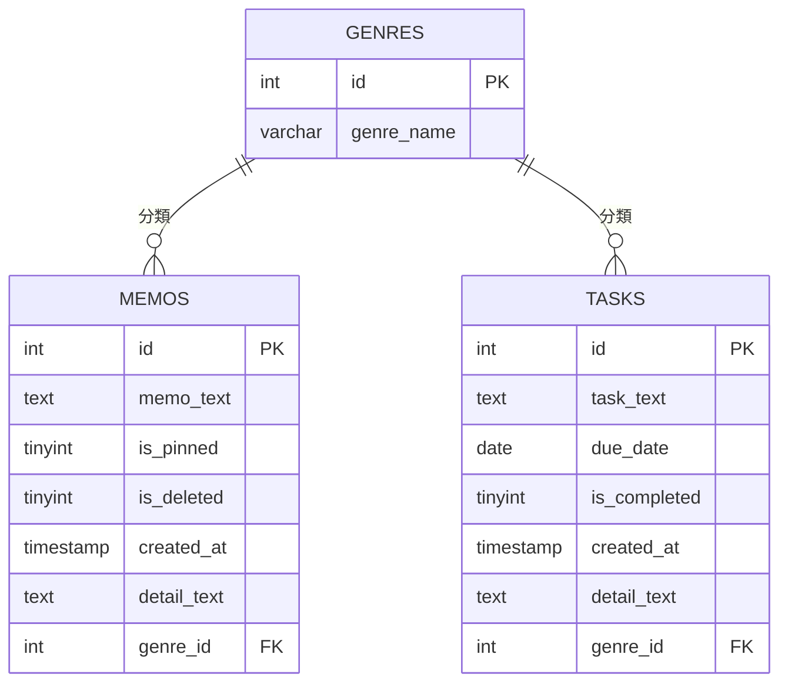

# KeepMemo++

 **雑に残せて、ちゃんと見つかる。**

思いついたことを気軽に残し、必要になったときにはちゃんと見つけられる。

KeepMemo++は、「残しやすさ」と「見つけやすさ」の両立を目指した、メモ・タスク管理Webアプリです。

---

## 背景（Why）

日常の中には、「今は必要ないけれど、後で見返したい情報」がたくさんあります。

気になったWebサイト、後で調べたいこと、ふと思いついたアイデア、忘れたくない予定。

こうした情報を残すために、LINEのKeepメモやブラウザのブックマーク、スマートフォンのメモアプリなどを使っている人も多いのではないでしょうか。

自分自身もよく使っており、学校や身近な人に聞いてみても、同じような使い方をしている人は多くいました。

そこで、一つ疑問を持ちました。

**なぜ、私たちはKeepメモやブックマークを使うのでしょうか。**

情報をきれいにまとめて残すのであれば、Googleドキュメントのようなツールがあります。

やるべきことを管理するのであれば、期限や完了状態まで設定できるToDoアプリがあります。

それでも、

気になったURLは、とりあえずブックマーク。  
思いついたことは、とりあえずKeepメモ。

という使い方をすることがあります。

これは、メモだけの話ではありません。

例えば、出かける前に突然、

**「帰りに牛乳を買ってきて」**

と頼まれたとします。

これは明確な「タスク」です。

ToDoアプリなら期限を設定できる。
完了したかどうかも管理できる。
他のタスクとまとめて確認することもできます。

タスクを管理する機能だけを見れば、KeepメモよりもToDoアプリの方が充実しています。

それでも、

「あとでLINEを返す」  
「帰りにこれを買う」  
「このサイトを後で確認する」

といったちょっとした「やること」を、Keepメモなどに一言だけ残すことがあります。

自分自身もそうでした。

**なぜ、よりしっかり管理できるツールがあるのに、Keepメモを使うのか。**

実際の使い方を振り返ってみると、Keepメモには別の良さがありました。

突然頼まれた買い物なら、

「牛乳買う」

と入力して送るだけ。

気になるWebサイトなら、その場でブックマークするだけ。

ジャンルや期限、優先順位などを考える前でも、その瞬間に情報を残せます。

つまり、

**「整理する前の情報でも、そのまま残せる」**

という手軽さです。

しっかり管理できることではなく、**しっかり管理しなくても使えること自体に価値がある**のではないかと考えました。

---

### では、Keepメモだけで十分なのか

ここで、もう一つ疑問が生まれました。

**これだけ手軽なら、Keepメモだけでいいのではないか。**

しかし、自分自身が使い続ける中で、今度は「保存した後」に不便を感じることがありました。

例えば、先ほどの

「牛乳買う」

というタスク。

Keepメモに送れば、一瞬で残せます。

ただ、その後も

「LINEを返す」  
「書類を提出する」  
「このサイトを確認する」

とタスクを追加していけば、すべてが他のメモと一緒に時系列で並んでいきます。

すると、

**どのタスクの期限が近いのか分からない。**  
**どれが終わっていて、どれがまだ終わっていないのか分からない。**

「残す」ことはできても、「タスクとして管理する」ことは難しくなります。

これはメモでも同じでした。

Keepメモはトーク形式なので、思いついたことを一言ずつ残すには便利です。

一方で、保存した情報について後から詳しい情報を付け加えたくなることがあります。

例えば、

「○○株式会社」

と企業名だけ残した後に、

「説明会で○○という話が印象に残った」  
「選考は○月から」  
「このURLも関連している」

と情報を追加したくなった場合。

Keepメモでは、新しいメッセージとして送ったり、元のメッセージに返信したりする形になります。

自分はここに使いにくさを感じました。

**最初に残した情報と、後から分かった情報を、一つの情報として育てていきたい。**

さらに、情報が増えてくると、

**「確か保存したはずなのに、見つからない」**

という問題も出てきます。

数週間前に保存したURL。  
以前メモした企業名。  
どこかで残したアイデア。

いつ保存したのか。
どんな言葉で残したのか。

時間が経つほど曖昧になり、時系列の中に埋もれてしまいます。

つまり、Keepメモのような使い方には、

**「残す瞬間の手軽さ」**

という大きな価値がある一方で、

**「残した後の整理・管理・検索」**

には改善できる部分があると考えました。

だからといって、保存するときから細かい入力を求めてしまえば、今度はKeepメモの良さだった「とりあえず残せる」が失われてしまいます。

そこで考えたのが、

**残すときの手軽さは、そのままにできないか。**  
**そのうえで、残した後だけ、しっかり管理できないか。**

> **雑に残せて、ちゃんと見つかる。**

この考えから生まれたのが、**KeepMemo++**です。

---

## 概要（What）

**KeepMemo++**は、思いついた情報を一つの入力欄から「メモ」または「タスク」として保存し、必要になった情報を後から整理・管理・検索できるWebアプリです。

設計で大切にしたのは、

**「保存するときは軽く、保存した後はしっかり」**

という考え方です。

保存するときに必要なのは、基本的に本文だけ。

タイトルは必要ありません。
ジャンルや期限も必須ではありません。

まずは残す。

そのうえで、必要になった情報だけ、後から詳細・ジャンル・期限などを追加できます。

---

## なぜ、この機能にしたのか

### 1. 一つの入力欄からメモ・タスクを保存

日常で生まれる情報は、必ずしも最初からきれいに分類されているとは限りません。

「このサイト、後で見たい」  
「この企業について調べたい」  
「帰りに牛乳を買う」

メモもタスクも、最初にやりたいことは同じです。

**忘れる前に残すこと。**

そこで、メモとタスクで入力場所を分けず、一つの入力欄からどちらにも保存できるようにしました。

---

### 2. タスクは、保存した後に「タスクらしく」管理

Keepメモにタスクを残す手軽さはそのままに、保存後はタスクとして管理できるようにしました。

タスクには、

- 期限の設定
- 詳細の追加
- 完了処理

を用意しています。

さらに、期限を考慮して並び替えることで、取り組む必要のあるタスクを確認しやすくしています。

**入力するときは「牛乳買う」だけ。**

でも保存した後は、期限や完了状態を持った一つのタスクとして扱える。

この違いを意識しています。

---

### 3. メモは、後から情報を追加できる

最初から、すべての情報がそろっているとは限りません。

最初は企業名だけ。
後からURLが見つかる。
さらに説明会に参加して、残したい情報が増える。

そこでKeepMemo++では、最初に保存した内容に対して、後から詳細情報を追加できるようにしました。

新しいメッセージとして情報を追加していくのではなく、

**一つのメモに、後から情報を付け足していく。**

必要になった情報だけを、少しずつ整理できるようにしています。

---

### 4. ジャンルは必須にしない

検索・整理のためにジャンル機能を用意しています。

ただし、保存時の設定は必須ではありません。

毎回ジャンルを選ばなければならないと、

「これはどこに分類すればいいんだろう」

と考える必要が生まれます。

それでは、「とりあえず残せる」という良さが弱くなってしまいます。

そのため、

**まず保存する。必要なら、後からジャンルを付ける。**

という形にしています。

---

### 5. 雑に残したからこそ、検索を充実させる

保存時に細かい整理を求めない以上、情報が増えた後に探せる仕組みが必要です。

そこで、

- キーワード
- ジャンル
- 期間

などから検索できるようにしました。

さらに、複数の条件を組み合わせて絞り込むこともできます。

例えば、

**「数か月前に保存した、就活関係の情報」**

なら、

「保存した期間」×「就活ジャンル」

というように、覚えている情報から候補を絞っていけます。

**保存するときに整理しなかった分、探すときの選択肢を増やす。**

これが検索機能を充実させた理由です。

---

### 6. 忘れていた情報にも、もう一度出会える

検索にも弱点があります。

保存したこと自体を忘れていたら、そもそも検索しません。

そこで、

- 1日前
- 3日前
- 7日前

に保存した情報をもう一度表示するリマインド機能を用意しました。

**覚えている情報は、検索で見つける。**  
**忘れている情報は、もう一度目に入るようにする。**

2つの方法から、保存した情報を再発見できるようにしています。

---

## アプリ名について

**KeepMemo++**という名前には、Keepメモのような「気軽に残せる」という価値に、自分が欲しかった2つの価値を加えるという意味を込めています。

**KeepMemo**  
→ 思いついた情報を気軽に残す。

**+ Task**  
→ ちょっとした「やること」も、保存後はタスクとして管理できる。

**+ Search**  
→ 雑に蓄積した情報も、後から複数の条件で探せる。

**KeepMemo + Task + Search = KeepMemo++**

です。

---

## 使い方（How）

1. 入力欄に残したい内容を入力します。
2. 「メモ」または「タスク」として保存します。
3. 必要に応じてジャンル・詳細・期限を後から追加します。
4. メモはメモ画面、未完了タスクはタスク画面から確認できます。
5. 過去の情報はキーワード・ジャンル・期間などから検索できます。
6. リマインド画面では、過去に保存した情報をもう一度確認できます。

### 公開アプリ

**KeepMemo++を実際に操作できます。**

https://memo-task-app.great-site.net/demo/

---

## 使用技術 / 開発環境

### 使用技術

- HTML
- CSS
- PHP
- MySQL

### 開発環境

- Visual Studio Code
- XAMPP
- phpMyAdmin

---

## 技術的な工夫

### 複数条件による検索

KeepMemo++では、「雑に残した情報を後から見つけられること」を重視しています。

そのため、単純なキーワード検索だけではなく、キーワード・ジャンル・期間などを組み合わせた検索に対応しました。

入力された検索条件に応じてSQLの検索条件を変更することで、複数条件による絞り込みを実現しています。

### メモとタスクで異なる表示順

入力時は同じ場所から保存できますが、保存後に求める見せ方は異なります。

メモはピン留めされたものを優先し、その後に新しいものから表示。

タスクは期限の有無や期限日などを考慮して並び替え、取り組む必要のあるものを確認しやすくしています。

### 後から整理できるデータ構造

メモ・タスク・ジャンルの情報はMySQLで管理しています。

メモとタスクそれぞれに `genre_id` を持たせ、`genres` テーブルと関連付けています。

ジャンルは必須ではなく、保存時には設定せず、必要になった場合に後から追加することもできます。

また、

- メモのピン留め・削除状態
- タスクの完了状態
- 期限
- 詳細情報

などもデータベース上で管理しています。

---

## スクリーンショット

### メイン画面



### メモ画面



### タスク画面



### ジャンル管理画面



### 検索画面



---

## ER図

KeepMemo++では、`memos`、`tasks`、`genres` の3つのテーブルを使用しています。

メモとタスクがそれぞれ `genre_id` を持ち、`genres` テーブルと関連する構成にしています。



---

## ディレクトリ構成

主要なファイルを役割ごとに整理しています。

```text
memo-task-app/
├── actions/
│   ├── save.php
│   ├── memo_update.php
│   ├── task_update.php
│   └── genre_update.php
│
├── assets/
│   ├── css/
│   │   └── style.css
│   │
│   └── images/
│       ├── home.png
│       ├── memo.png
│       ├── task.png
│       ├── genres.png
│       └── search.png
│
├── config/
│   └── db.example.php
│
├── includes/
│   ├── input_form.php
│   └── calendar.php
│
├── index.php
├── memos.php
├── tasks.php
├── search.php
├── genre_manage.php
├── README.md
└── .gitattributes
```

### 各ディレクトリの役割

- `actions/`：保存・更新・完了・削除などの処理
- `assets/`：CSSやREADME掲載用画像などの静的ファイル
- `config/`：データベース接続設定
- `includes/`：複数画面で利用する共通処理・UI

データベースの接続情報そのものは公開せず、構成を確認できるように `db.example.php` を掲載しています。

---

## 今後の改善

- スマートフォンでの操作性向上
- 複数ワークスペースへの対応
- ログイン機能の実装
- UI・デザインの改善
- コードのさらなる共通化・整理
- リマインド機能の拡張

---

## 作者

個人開発のポートフォリオとして制作しました。
